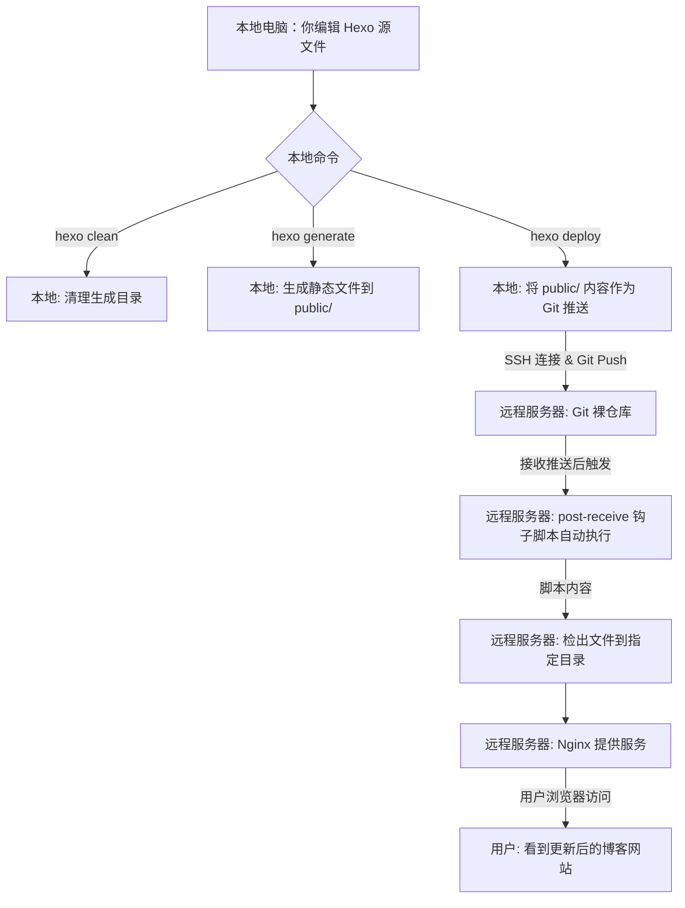

## 基础知识

### 安装与部署

#### 一、hexo 项目创建
1. 安装 node.js 和 git
前往官网使用安装包下载


2. 安装 hexo
`npm install -g hexo-cli`
``
3. 创建 hexo 项目
```bash
hexo init hexo-blog
cd hexo-blog
npm install  # 安装项目依赖
```

4. 修改 url
在文件 `_config.yml` 中添加 url
`url: http://aandnet.lorden.xyz/`

#### 二、服务器设置

1. 域名新增节点
- 根据我的目标 `url: http://aandnet.lorden.xyz/`，在阿里云解析DNS中添加新的**主机记录**
1. 创建网站目录
```bash
sudo mkdir -p /var/www/a-net-blog/public
sudo chown -R jay:jay /var/www/a-net-blog/public

sudo nano /etc/nginx/sites-available/a-net-blog.conf
```

```bash
# a-net-blog.conf
server {
    listen 80;
    server_name 47.109.159.2; # 或你的域名

    root /var/www/a-net-blog/public;
    index index.html index.htm;

    location / {
        try_files $uri $uri/ =404;
    }
}
```

3. 重载 nginx
```bash
sudo ln -s /etc/nginx/sites-available/a-net-blog.conf /etc/nginx/sites-enabled/
sudo nginx -t
sudo systemctl restart nginx # 首次启动或配置大改用restart，小改用reload
```

4. 创建 git 裸仓库
```bash
sudo mkdir -p /var/repo/a-net-blog-deploy.git
sudo chown -R jay:jay /var/repo/a-net-blog-deploy.git # 确保jay用户有权限
cd /var/repo/a-net-blog-deploy.git
git init --bare
```

#### 三、创建 Git Hook 脚本

1. 创建 `post-receive` 脚本
```bash
cd /var/repo/a-net-blog-deploy.git/hooks
sudo nano post-receive
```

```bash
# post-receive
#!/bin/bash
# 定义网站根目录，Git 将会把内容检出到这里
PUBLIC_WWW="/var/www/a-net-blog/public"

# 使用 Git 命令将最新内容检出到网站根目录
# --work-tree 指定工作目录，-f 强制检出
git --work-tree="${PUBLIC_WWW}" checkout -f master
```

2. 赋予脚本执行权限
```bash
sudo chmod +x post-receive
```

3. 配置本地 Hexo 部署信息：
```yaml
# _config.yml
## Docs: https://hexo.io/docs/one-command-deployment
deploy:
  type: git
  repo: ssh://jay@47.109.159.2:2222/var/repo/a-net-blog-deploy.git  # 修改了 ssh 访问端口，从22改为了2222，因为我的公网限制了对22端口的访问
  branch: master
```

4. 修改 public 文件夹权限
```bash
sudo chown -R jay:jay /var/www/a-net-blog/public
```


#### 四、尝试部署

```bash
hexo clean 
hexo generate 
hexo deploy

# 或者 hexo clean; hexo g; hexo d
```

部署成功。


#### 五、代码更新

```bash
git status  # 查看修改。
git add .   # 暂存修改。
git commit -m "Your meaningful commit message" # 提交修改到本地仓库。

# 或者 git status; git add .; git commit -m "Your meaningful commit message"
```


### 认识项目

```text
hexo-blog/
├── .deploy_git/           # 临时 git 仓库
├── .git/                  # Git 管理文件
├── .github/               # 依赖管理
│   └── dependabot.yml     # 入口文件
├── node_modules/          # node.js 项目的依赖项
├── scaffolds              # 模板文件夹
├── source/                # 资源管理
│ 	├── _posts             # 博客文章
│   └── dependabot.yml     # 入口文件
├── theme/                 # 主题管理
├── .gitignore             # Git 忽略
├── _config.yml            # 网站配置
└── package.json           # 项目依赖
```
#### .deploy_git

是由 Hexo 的 Git 部署插件 (`hexo-deployer-git`) 在你的本地 Hexo 项目中创建和维护的一个临时的、内部的 Git 仓库

#### .git
`.git` 文件夹是 Hexo 项目本身的 Git 仓库

#### .github/dependabot.yml
自动管理和更新 Hexo 博客所依赖的 npm 包，从而提高项目的安全性和维护性。

#### node_modules
`node_modules` 文件夹是 `npm` (Node Package Manager) 或 `yarn` 等包管理器下载和安装项目所有依赖项（即第三方库、模块或包）的地方。`npm` 会将这些直接依赖以及它们各自的依赖（这些依赖的依赖...）递归地下载并安装到 `node_modules` 文件夹中。

#### scaffolds
模版文件夹。 新建文章时，Hexo 会根据 scaffold 来创建文件。

#### source
资源文件夹。 是存放用户资源的地方。 除 `_posts` 文件夹之外，开头命名为 `_` (下划线)的文件 / 文件夹和隐藏的文件将会被忽略。 Markdown 和 HTML 文件会被解析并放到 `public` 文件夹，而其他文件会被拷贝过去。

#### themes
如果使用 `npm install --save hexo-theme-fluid` 这样的命令安装主题，主题的实际文件会下载到 `node_modules/hexo-theme-fluid/`。但 Hexo 在主 `_config.yml` 里配置 `theme: fluid` 时，会智能地知道去 `node_modules` 查找。不过，`themes/` 仍然是 Hexo 默认和推荐存放手动安装或自定义主题的地方。


# Hexo 博客部署与 Git Hook 自动化更新原理揭秘

经过一番努力，你的 Hexo 博客已经成功地部署上线，并通过 `hexo deploy` 实现了自动化更新。这背后并非魔法，而是 Git Hooks (Git 钩子) 在默默发挥作用。本文将深入浅出地为你揭示从本地 `hexo deploy` 到网站内容更新的完整逻辑和原理。

## 核心原理：Git Hooks (Git 钩子)

整个自动化部署和更新流程的基石是 **Git Hooks（Git 钩子）**。Git 钩子是 Git 版本控制系统提供的一种强大机制，**它允许你在 Git 仓库生命周期的特定事件发生时，自动执行预设的脚本。**

在我们的 Hexo 自动化部署场景中，最关键的钩子是 `post-receive`。当远程 Git 仓库成功接收到代码推送之后，`post-receive` 钩子就会被自动触发执行。

## 部署流程原理详解

让我们将整个过程拆解为几个关键步骤。

### 1. 本地操作：
`hexo clean && hexo generate && hexo deploy`

这是你在本地计算机上执行的一系列命令，用于准备和发起部署：

- **`hexo clean`**: 这个命令会清除你本地 `public/` 目录下上一次生成的静态文件，以及 Hexo 的缓存文件。这样做是为了确保每次部署都是基于最新的源文件，避免旧文件残留或缓存导致的问题。

- **`hexo generate`**: Hexo 会根据你本地 Hexo 项目目录下的源文件（如 Markdown 格式的文章、图片、主题文件、配置文件 `_config.yml` 等），将其编译并生成最终的静态网站文件。这些文件包括 HTML、CSS、JavaScript 以及图片资源等，它们会存放在你本地项目的 `public/` 目录下。这些文件就是你的博客最终在用户浏览器中呈现的内容。

- **`hexo deploy`**: 这是整个部署流程的触发点。
    - `hexo-deployer-git` 插件会发挥作用，它会使用你本地项目中的 `.deploy_git/` 隐藏目录（这是一个临时的 Git 仓库）作为中转。
    - 该插件会将 `public/` 目录下所有**生成的静态网站文件**复制到这个 `.deploy_git/` 临时 Git 仓库中。
    - 随后，它会执行标准的 Git 命令，如 `git add .`、`git commit -m "Site updated: [日期时间]"`等，并将这些提交**推送到**你在 `_config.yml` 中 `deploy` 配置项所指定的远程 Git 仓库。
    - 在你当前的配置中，这个远程仓库是你的服务器上的一个 **Git 裸仓库（Bare Repository）**，位于 `ssh://jay@47.109.159.2:2222/var/repo/a-net-blog-deploy.git`。

简而言之，`hexo deploy` 的本质就是通过 SSH 协议，将你本地生成的静态网站文件像普通的 Git 代码一样推送到服务器上的特定 Git 仓库。

### 2. 服务器端：Git 裸仓库接收推送

一旦你的本地 `hexo deploy` 命令成功将静态文件推送到服务器上的 `/var/repo/a-net-blog-deploy.git` 这个 Git 裸仓库，该仓库就会立即识别到一个 `post-receive` 事件。

- Git 裸仓库（Bare Repository）与普通 Git 仓库的区别在于，它没有工作目录，只保存了 Git 的版本历史数据，主要用于团队协作的中央存储或作为部署目标。
- `post-receive` 钩子脚本就是在此刻被 Git 服务端自动调用的。

### 3. 服务器端：`post-receive` 脚本的自动化执行

你之前在服务器上配置并修改的 `post-receive` 脚本就位于 Git 裸仓库的 `hooks` 目录下（`/var/repo/a-net-blog-deploy.git/hooks/post-receive`）。当 Git 裸仓库接收到推送后，它就会自动运行此脚本。

这个脚本的核心任务是将刚刚推送过来的最新网站文件从 Git 仓库中“释放”出来，并放到 Web 服务器（Nginx）可以访问的目录下：

Bash

```
#!/bin/bash
# post-receive

# 1. 定义网站根目录 (Nginx 指向的目录)
PUBLIC_WWW="/var/www/a-net-blog/public"

# 2. 将 Git 仓库中最新的内容检出到网站根目录
# --work-tree 指定工作树，-f 强制检出
git --work-tree="${PUBLIC_WWW}" checkout -f master

# 3. (可选但推荐，以防git --work-tree模式不彻底清除旧文件)
# rsync -av --delete --exclude=.git/ --exclude=.git /tmp/hexo-deploy/ "$PUBLIC_WWW"/

# 权限处理的简化：
# 我们此前遇到的 sudoers 问题已通过手动将 /var/www/a-net-blog/public 的所有者改为 jay:jay 解决。
# 且由于 "others" 具有读权限，Nginx 能够正常访问。
# 因此，脚本中不再需要复杂的 chown 或 sudo 命令。

# 4. (如果需要) 重新加载 Nginx 配置
# 如果你的 Nginx 配置（例如反向代理规则）有变化，可能需要执行以下命令，
# 但对于简单的内容更新，通常不需要：
# systemctl reload nginx
```

**这个脚本的关键逻辑是：**

- **检出文件：** 脚本使用 `git --work-tree="/var/www/a-net-blog/public" checkout -f master` 命令。这会强制 Git 将裸仓库中 `master` 分支的最新内容直接检出（复制并覆盖）到 `/var/www/a-net-blog/public` 这个 Nginx 网站根目录中。
- **权限处理的巧妙简化：** 最初我们尝试在脚本中用 `sudo chown` 来改变文件所有者。但由于 `sudoers` 配置的复杂性，我们采取了更直接有效的策略：
    - 在服务器上，你已经一次性地将 `/var/www/a-net-blog/public` 目录及其内容的**所有者**设置为了 `jay` 用户，**组**设置为了 `jay`。
    - 同时，你确保了“其他人”对该目录拥有“读取”权限 (`r-x`)。
    - 当 `hexo deploy` 推送文件时，这些文件自然会以 `jay` 用户身份创建（因为你是 `jay` 用户在推送）。
    - 由于 Nginx (通常运行为 `www-data` 用户) 作为“其他人”仍然具有读取权限，它能够正常访问并提供这些文件。
    - 因此，`post-receive` 脚本中不再需要任何 `chown` 或 `sudo` 命令，这大大简化了流程，并避免了权限问题。

### 4. Nginx 提供服务

一旦 `post-receive` 脚本将最新的静态网站文件成功复制并同步到 `/var/www/a-net-blog/public` 目录后，Nginx Web 服务器会立即提供这些更新后的内容。当用户在浏览器中访问你的博客网址时，Nginx 就会从这个目录中抓取最新版本的 HTML、CSS、JS 等文件，并发送给用户的浏览器进行展示。

## 总结流程图

代码段



通过这一系列步骤和 Git Hooks 的巧妙运用，你实现了从本地内容创作到远程网站更新的自动化流程，极大地提高了效率，让你可以专注于内容的创作本身。